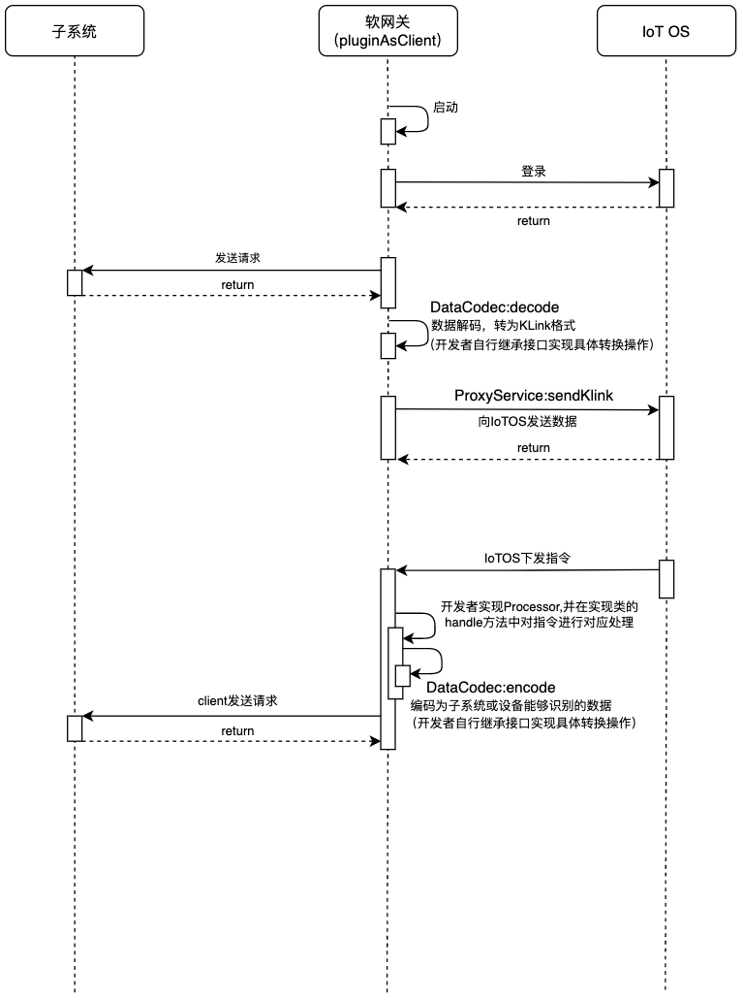
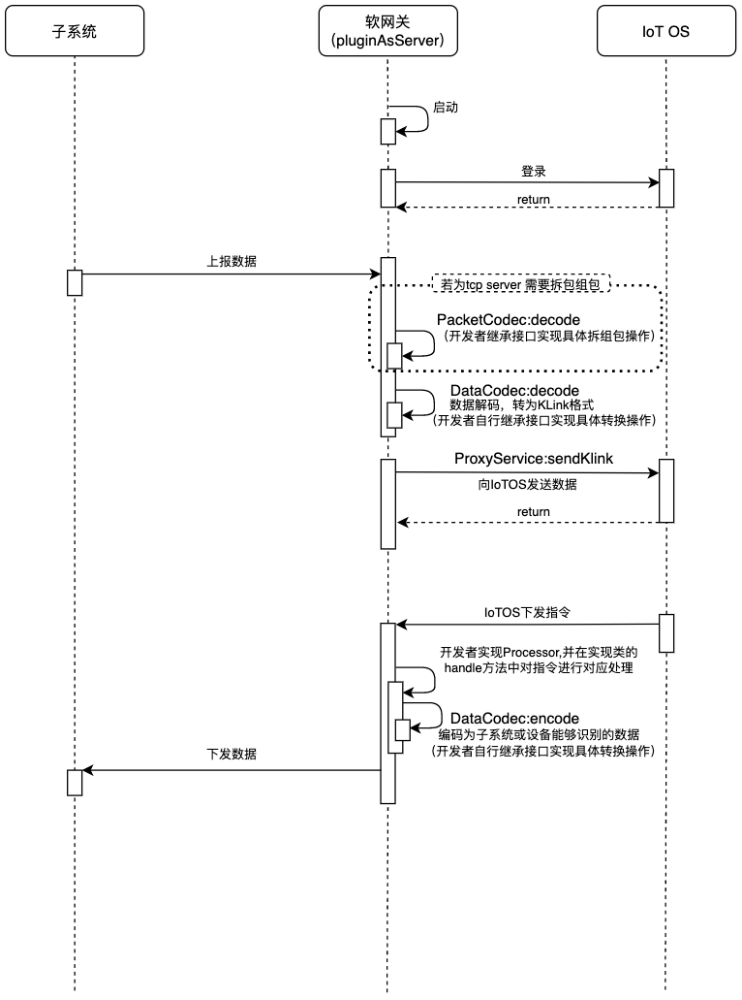

## 简要说明
软件网关作为IoTOS的配套组件，以开源形式提供，对于一些无法直连到IoTOS上的设备，研发人员可以基于此配套代码做二次开发并解决连接问题。

## 程序时序图
以下分别为软网关作为客户端和服务端的程序时序图
###客户端程序时序图

###服务端程序时序图


## 使用指南
此处简要描述使用本软网关主要步骤

### 1、配置参数
【参数配置具体配置在```src/main/resources/config.properties```中】

开发者首先在IoTOS将对应的网关设备和子系统设备创建完毕，并在IoTOS中获取以下必填信息：
- 连接host
- 产品pk
- 设备id
- 设备密钥
- 子系统设备所属产品pk
- 子系统设备所属产品密钥

【注】：其中前四项属于网关连接必填参数，用于软网关连接到IoTOS，为软网关启动的基础。
后两项为设备上报必须参数，用于对接设备。

并在配置文件中把服务端或客户端的配置信息填写完成。

### 2、二次开发
开发者完成设备对接必须要实现两处接口：

- 数据编解码部分（DataCodec）

用户需要实现DataCodec以完成子系统或设备数据与IoTOS Klink数据的转换。

详细可以参考```src/main/java/hekr/me/iotos/softgateway/common/codec/RawDataCodec.java```中对透传数据的解析。

- IoT OS下发指令的代理解析（Processor）

用户需要实现Processor来对IoT OS的指令进行区分操作。

如```src/main/java/hekr/me/iotos/softgateway/northProxy/processor/CloudSendProcessor.java```中完成了对IoTOS"cloudSend"指令的处理。

【注】：需要在程序运行时完成Processor的装配，即在main函数里调用```ProxyCallbackService.processorManager.register(new CloudSendProcessor());```。

- 拆包组包部分（PacketCodec）*

若需要使用到软网关作为tcp server进行对接，则需要额外实现对包的处理。
用户需要实现PacketCodec接口来根据传输协议进行二次开发。

```src/main/java/hekr/me/iotos/softgateway/pluginAsServer/tcp/packet/LinePacketCodec.java```是以换行符作为拆包标志的协议示例代码。

### 3、开发参考建议
- 开发者可以自行导入springboot以方便开发，如Processor的自动装配等
- 建议开发者将实际设备和IoTOS设备的映射关系缓存在内存中，甚至持久化，方便设备的对接与维护


```json
{"channelID":1,"devId":"barrier001","deviceType":"BARRIER","devName":"道闸一号"}
```
