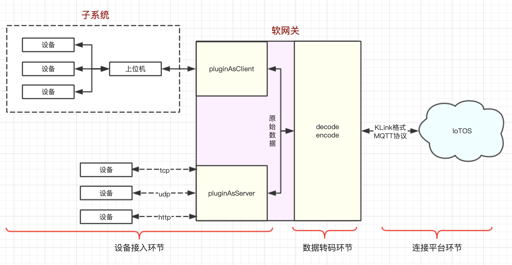

# 1. 背景

目前有两类情况可能会导致设备或子系统无法连接至 IoTOS：

- IoTOS 目前支持 MQTT、CoAP、LwM2M、HTTP 这四种协议，且认证方式要符合 IoTOS 的规定，但很多存量设备或者子系统使用了 TCP\UDP\WS
  等协议，且认证方式多种多样，甚至连产品标识（对应 IoTOS 里的 PK）也有缺失；
- IoTOS 作为物联网中台对南向设备只有 Server 的角色，没有 Client 的角色，但很多子系统往往提供的是 Server，因此在 IoTOS 和子系统之间必须有一个程序充当 Client
  从子系统拉取数据并传到 IoTOS。

本工程，即**软件网关**，作为 IoTOS 的配套组件，以开源形式提供，研发人员可以基于此代码进行二次开发解决以上2类问题。

# 2. 使用须知

## 2.1 环境要求

* JDK 1.8及以上版本
* Maven
* Git

## 2.2 适用场景

软件网关可用于解决以下2类无法连接 IoTOS 的设备或子系统的情况：

- 基于 TCP、UDP 和 HTTP 等私有协议的设备或子系统；
- 自带上位机的软硬件一体系统，该类系统可能暴露如 HTTP、TCP、UDP、JDBC、ODBC 等各种接口对外提供数据。

# 3. 简要设计说明

下图是软件网关的基本工作原理，包含三个主要环节：



1. 设备接入环节 软件网关中内置了 Server 能力，默认支持 TCP、UDP、HTTP 协议的接入。使用者需要自行实现上报数据的拆包/组包（当为 TCP 时）功能。

同时软件网关也内置了 Client 能力，默认支持向子系统发起 TCP、UDP、HTTP 请求，从而实现与子系统的交互。

开发者需要自行实现交互逻辑，还可以自行扩展实现更多协议的支持。

2. 数据转码环节 此环节需实现设备原始数据格式（即设备或子系统认识的数据格式）和 KLink （IoTOS 内置的标准数据格式，采用 JSON 标准）的互相转换，使用者需要自行实现
   encode（原始数据转 KLink） 和 decode（KLink 转原始数据）这两个 interface。

3. 与 IoTOS 交互环节 软件网关使用 MQTT 协议实现与 IoTOS 的交互，使用者只需配置相关参数即可。

IoTOS 与软件网关交互的数据中一定包含 PK 和 devID，若存量设备本身不含 PK 等标识信息，开发者则需自行完成映射。

例如，子设备发送亮度状态值```light```为90，软件网关发送给 IoTOS 的数据格式如下：

```json
{
  "action": "devSend",
  "msgId": 1,
  "pk": "3276aa89d25a46b789c7987421396e05",
  /* 子设备PK */
  "devId": "dev-001"
  /* 子设备ID */
  "data": {
    "cmd": "report",
    "params": {
      "light": 90
    }
  }
}
```

|参数|必填|类型|说明|
|---|---|---|---|
|action|是|string|动作，固定为 devSend|
|pk|否|string|要发送数据的设备产品PK|
|devId|否|string|要发送数据的设备ID|
|data|是|object|上报的指令和参数数据|
|data.cmd|是|string|标识符|
|data.params|否|object|参数|

# 二次开发

软网关框架在一定程度上封装了交互流程。

目录结构：

- `framework-core` 和 IoTOS 平台交互的主要代码
- `framework-network-common` 网络组件通用代码
- `framework-network-tcp` tcp 客户端和服务器
- `framework-network-udp` udp 客户端和服务器
- `subsystem` 子系统自定义功能实现部分，在这里开发，并运行 IoTGatewayApplication.java
- `example` 示例代码，包含网络组件的使用方式使用的时候先启动对应的 server，再启动对应的 client
- `subsystem/src/main/resources/application.yml` 服务配置文件

其中 core 是必须的， tcp 和 udp 模块按需加载。

## 功能封装

框架封装了软网关设备和 IoTOS 平台的交互过程，包括：

- 网关登录
- 自动重连
- 命令发送和接收
- 子设备注册和添加拓扑
- 远程配置，自动更新本地映射关系
- 简易客户端（包括 udp，tcp）
- 简易服务端（包括 udp，tcp）

## 功能开放

- IoTOS 平台交互： KlinkService 类
- mqtt 连接监听 MqttDisConnectListener 类
- mqtt 断开连接监听 MqttDisConnectListener 类
- server 消息回调，事件回调
- client 自动重连，异步、同步消息处理

## 基本使用

### 子设备登录、登出

调用 `KlinkService#devLogin` 方法可以使子设备在线；`devLogout` 则可以使子设备离线。

### 发送业务数据

发送的业务数据的字段需要在产品的[物模型](http://hy.hekr.me/iot-docs-test/web/content/%E8%AE%BE%E5%A4%87%E6%8E%A5%E5%85%A5/%E7%89%A9%E6%A8%A1%E5%9E%8B.html)中定义，并且定义相应的命令。

发送数据使用方法： `KlinkService#devSend`。该方法重载了几个方法：

- `public void devSend(String pk, String devId, String cmd)` 可以只发送命令
- `public void devSend(String pk, String devId, String cmd, Map<String, Object> params)` 发送命令和参数
- `public void devSend(DeviceMapper mapper, ModelData data)` 直接使用 DeviceMapper 发送数据

#### 设备映射

DeviceRemoteConfig 类做了设备映射关系；该关系是通过服务启动的时候自动获取远程配置或者主动更新远程配置来做映射的。

主要方法有：

- `public static Set<DeviceRemoteConfig> getAll()` 获取所有设备信息
- `public static Optional<DeviceRemoteConfig> getByPkAndDevId(String pk, String devId)` 根据 pk 和 devId
  获取设备信息
- `public static Optional<DeviceRemoteConfig> getBySubSystemProperties(Props p)` 根据子系统的设备属性获取设备信息
- `public static String getStatus()` 获取状态信息
- `public String getPk()` 获取设备的 pk
- `public String getDevId()` 获取设备的 devId
- `public String getDevName()` 获取设备的名字
- `public <T> T getProp(String prop)` 根据属性名字获取设备属性值，注意远程配置中数据类型

你还可以实现 `DeviceMapper` 接口，直接将属性绑定到接口上，这样就可以用类似 `devSend(DeviceMapper mapper, ModelData data)` 的方法进行发送数据，而无需每次都要手动匹配设备。

### 下发命令处理

框架封装了下发命令处理过程，只需要实现 `SubsystemCommandService` 接口并根据要求定义成 Spring 的 bean 即可，Bean要求：

实现类要加 `@Service("{CMD}"+Constants.CMD_BEAN_SUFFIX)`，其中 `{CMD}` 为 IoTOS 物模型命令。

实现方法 `void handle(DeviceRemoteConfig deviceRemoteConfig, ModelData data)`；参数 `deviceRemoteConfig` 是控制的设备， `data`
是物模型信息，实际需要参考子产品定义的物模型。

### 其他开发接口

- `MqttDisConnectListener` mqtt 连接监听，可以参考 `CoreMqttConnectedListenerImpl`
  实现；如果需要在软网关连接建立或者重连的时候进行业务处理，可以实现这个接口
- `MqttDisConnectListener` mqtt 断开连接监听，可以参考 `CoreMqttDisConnectListenerImpl`
  实现；如果需要在软网关连接断开的时候进行业务处理，可以实现这个接口
- `TcpMessageListener` tcp server 消息处理监听器
- `CommonMessageListener` tcp client, udp client, udp server 消息处理监听器
- `EventListener` 事件监听器

### 发布

修改deploy.sh 文件中的版本号，然后 执行

`./deploy.sh`

执行完成后，提交到 gitee 上。
