// FIXME 补充 udp，tcp 客户端使用方法，demo // 补充 udp server， tcp server // 补充mqtt server // 补充 mqtt client

# 1. 背景

目前有两类情况可能会导致设备或子系统无法连接至 IoTOS：

- IoTOS 目前支持 MQTT、CoAP、LwM2M、HTTP 这四种协议，且认证方式要符合 IoTOS 的规定，但很多存量设备或者子系统使用了 TCP\UDP\WS
  等协议，且认证方式多种多样，甚至连产品标识（对应 IoTOS 里的 PK）也有缺失；
- IoTOS 作为物联网中台对南向设备只有 Server 的角色，没有 Client 的角色，但很多子系统往往提供的是 Server，因此在 IoTOS 和子系统之间必须有一个程序充当 Client
  从子系统拉取数据并传到 IoTOS。

本工程，即**软件网关**，作为 IoTOS 的配套组件，以开源形式提供，研发人员可以基于此代码进行二次开发解决以上2类问题。

# 2. 使用须知

## 2.1 环境要求

* JDK 1.8及以上版本
* Maven
* Git

## 2.2 适用场景

软件网关可用于解决以下2类无法连接 IoTOS 的设备或子系统的情况：

- 基于 TCP、UDP 和 HTTP 等私有协议的设备或子系统；
- 自带上位机的软硬件一体系统，该类系统可能暴露如 HTTP、TCP、UDP、JDBC、ODBC 等各种接口对外提供数据。

# 3. 简要设计说明

下图是软件网关的基本工作原理，包含三个主要环节：


1. 设备接入环节 软件网关中内置了 Server 能力，默认支持 TCP、UDP、HTTP 协议的接入。使用者需要自行实现上报数据的拆包/组包（当为 TCP 时）功能。

同时软件网关也内置了 Client 能力，默认支持向子系统发起 TCP、UDP、HTTP 请求，从而实现与子系统的交互。

开发者需要自行实现交互逻辑，还可以自行扩展实现更多协议的支持。

2. 数据转码环节 此环节需实现设备原始数据格式（即设备或子系统认识的数据格式）和 KLink （IoTOS 内置的标准数据格式，采用 JSON 标准）的互相转换，使用者需要自行实现
   encode（原始数据转 KLink） 和 decode（KLink 转原始数据）这两个 interface。

3. 与 IoTOS 交互环节 软件网关使用 MQTT 协议实现与 IoTOS 的交互，使用者只需配置相关参数即可。

IoTOS 与软件网关交互的数据中一定包含 PK 和 devID，若存量设备本身不含 PK 等标识信息，开发者则需自行完成映射。

例如，子设备发送亮度状态值```light```为90，软件网关发送给 IoTOS 的数据格式如下：

```json
{
  "action": "devSend",
  "msgId": 1,
  "pk": "3276aa89d25a46b789c7987421396e05",
  /* 子设备PK */
  "devId": "dev-001"
  /* 子设备ID */
  "data": {
    "cmd": "report",
    "params": {
      "light": 90
    }
  }
}
```

|参数|必填|类型|说明|
|---|---|---|---|
|action|是|string|动作，固定为 devSend|
|pk|否|string|要发送数据的设备产品PK|
|devId|否|string|要发送数据的设备ID|
|data|是|object|上报的指令和参数数据|
|data.cmd|是|string|标识符|
|data.params|否|object|参数|

# 二次开发

软网关框架在一定程度上封装了交互流程。

目录结构：

- `framework-core` 和 IoTOS 平台交互的主要代码
- `framework-network-common` 网络组件通用代码
- `framework-network-tcp` tcp 客户端和服务器
- `framework-network-udp` udp 客户端和服务器
- `subsystem` 子系统自定义功能实现部分，在这里开发，并运行 IoTGatewayApplication.java
- `example` 示例代码，包含网络组件的使用方式使用的时候先启动对应的 server，再启动对应的 client
- `subsystem/src/main/resources/application.yml` 服务配置文件

其中 core 是必须的， tcp 和 udp 模块按需加载。

## 功能封装

框架封装了软网关设备和 IoTOS 平台的交互过程，包括：

- 网关登录
- 自动重连
- 命令发送和接收
- 子设备注册和添加拓扑
- 远程配置，自动更新本地映射关系
- 简易客户端（包括 udp，tcp）
- 简易服务端（包括 udp，tcp）

## 功能开放

- IoTOS 平台交互： KlinkService 类
- mqtt 连接监听 MqttDisConnectListener 类
- mqtt 断开连接监听 MqttDisConnectListener 类
- server 消息回调，事件回调
- client 自动重连，异步、同步消息处理

## 基本使用

**本软网关封装功能依赖于IoTOS 平台的网关的远程配置功能。**

使用者操作流程如下（黄色部分是与软件网关相关的步骤）：

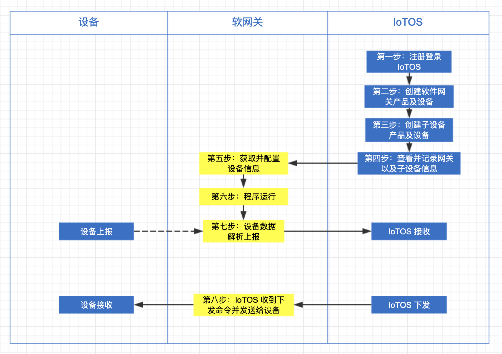

**第一步：注册登录 IoTOS**
因 IoTOS 以私有化部署为主，绝大部分情况下开发者可以 superadmin（即超级管理员）登录内网里部署的
IoTOS，本文以 [ IoTOS 体验站点](http://IoTOS-demo.hekr.me/)为例。

**第二步：创建软件网关产品及设备**
进入产品中心-产品开发，点击“创建产品”，建立软件网关，“产品信息”栏目根据实际需求而定，“节点类型”和“联网与数据”栏目配置图如下：

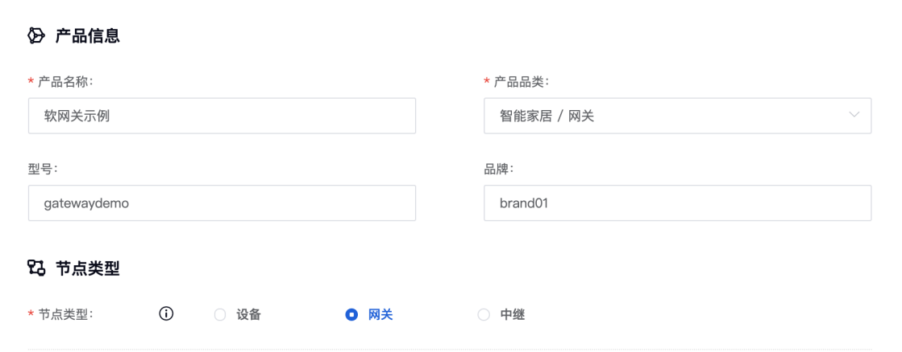

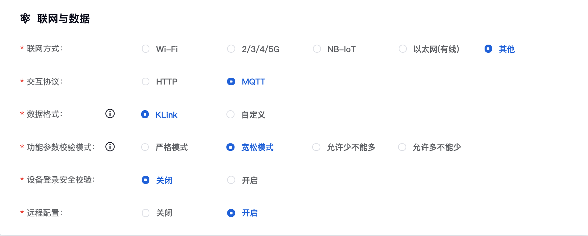

进入产品中心-设备管理，点击“创建设备”，其中设备 ID 后续会在软件网关代码里使用，取名方法根据实际需求而定。

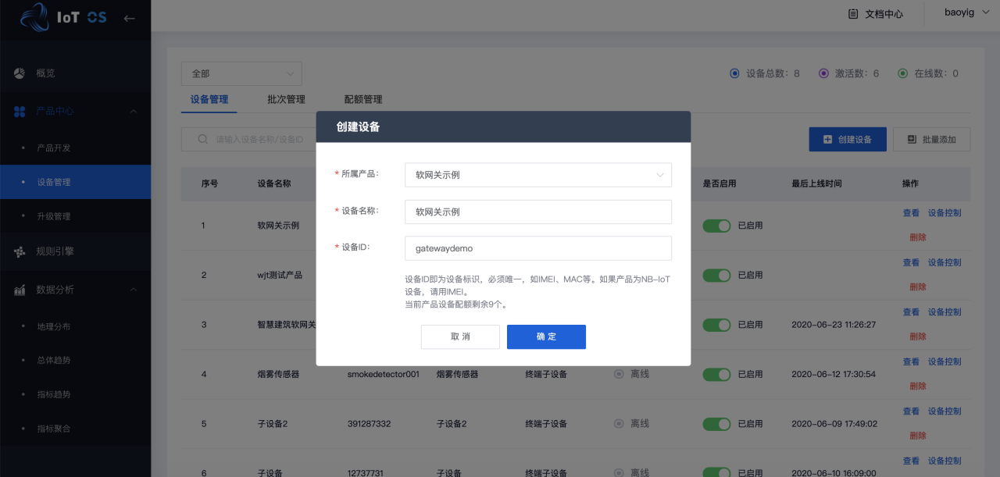

**第三步：创建子设备产品及设备**
进入产品中心-产品开发，点击“创建产品”，“产品信息”栏目根据实际需求而定，“节点类型”和“联网与数据”栏目配置图如下：

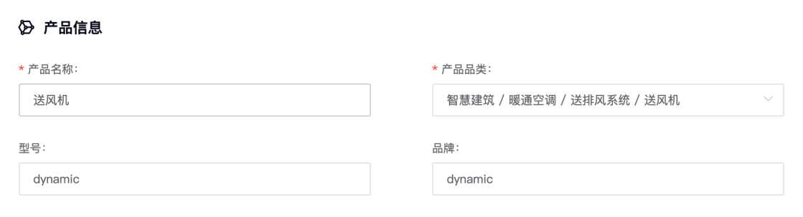

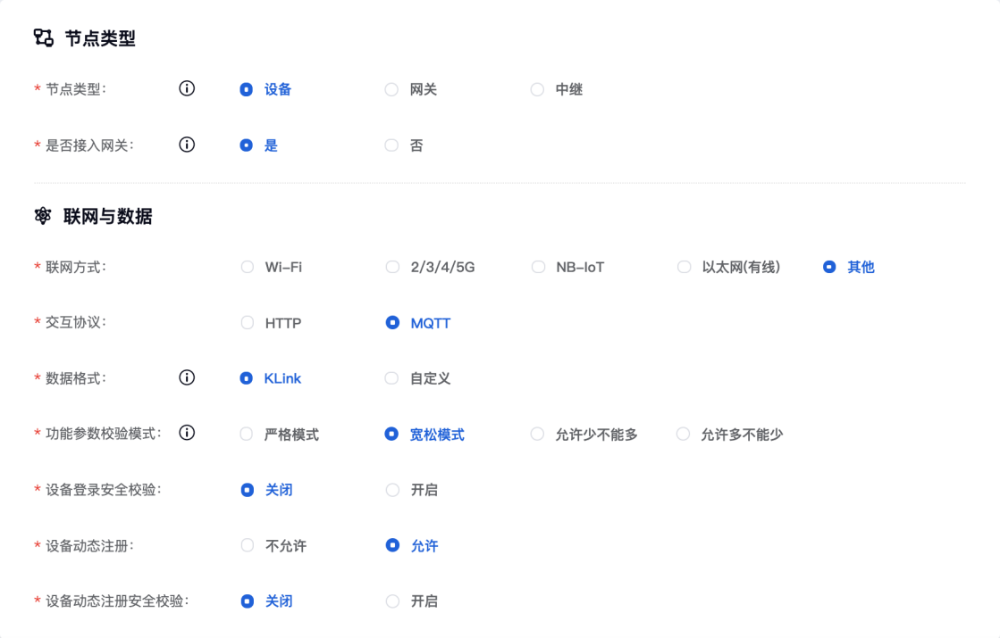

若使用者要求规范设备 ID，建议进入产品中心-设备管理，点击“批量添加”，使用表格模板实现批量导入。

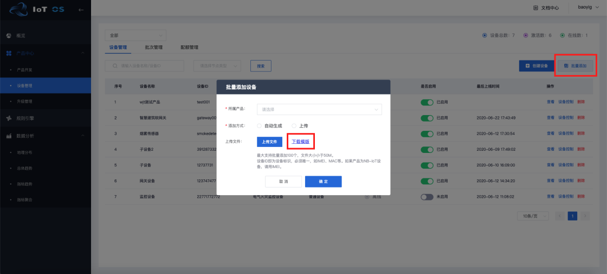

*注：此时软件网关的数据转码环节中子设备 ID 和表格应一一对应。*

**第四步：查看并记录网关以及子设备信息**
进入产品中心-设备管理，点击软件网关的右侧“查看”按钮。

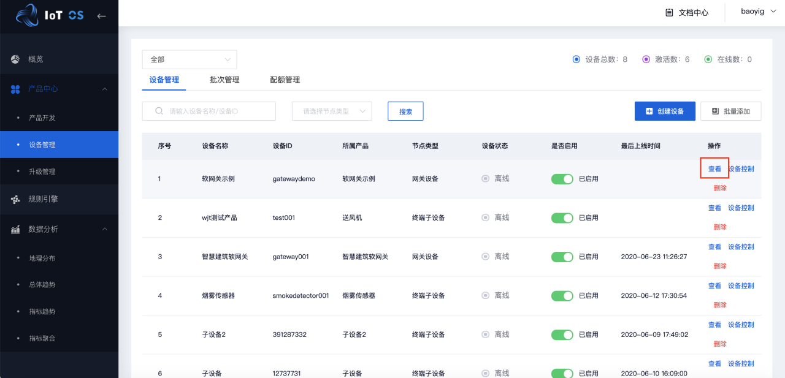

获取到软件网关 PK、设备 ID 和 devSecret。

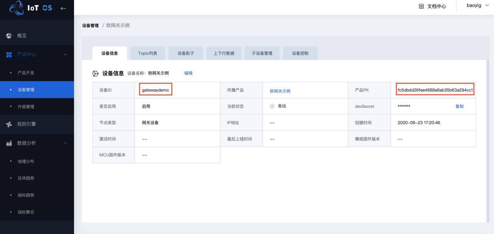

然后以相同的方式获取到子设备的产品 PK、设备 ID。

**第五步：获取并配置网关设备信息**
进入 IoTOS -产品中心-产品开发，点击上一步创建的软件网关产品，可以获取到 MQTT 接入方式信息，以此为 HOST 值。
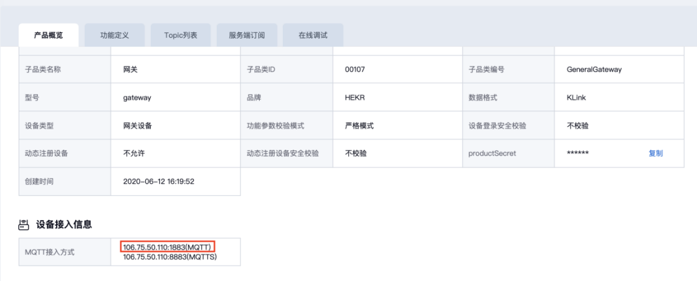

进入项目路径 `src/main/resources`，打开配置文件 `application.yml` 进行参数配置。

配置文件可以参考 [application.yml](subsystem/src/main/resources/application.yml) 以下配置项为软件网关配置的必填信息

```yaml
# mqtt配置（必填）
# 进入产品中心-产品开发-软件网关，"MQTT接入方式"栏目即可查询
connect.mqtt.endpoint: 106.75.50.110:1883
# 软件网关的产品pk，进入产品中心-设备管理-软件网关，"产品pk"栏目即可查询
gateway.pk: fc5dbdd26fee4688a6ab35b63a294cc1
# 软件网关的设备id，进入产品中心-设备管理-软件网关，"设备id"栏目即可查询
gateway.devId: gatewaydemo
# 软件网关的设备密钥，进入产品中心-设备管理-软件网关，"devSecret"栏目点击"复制"按钮即可查询
gateway.devSecret: d10d6a46f6b5462b88f0d07207479bd2
```

**第六步：程序运行**

进入项目路径并打开入口程序 [IoTGatewayApplication](src/main/java/me/hekr/iotos/softgateway/IoTGatewayApplication.java)

运行成功后，打开 IoTOS 平台，查看这个网关设备，可以看到设备已经在线，查看 `上下行数据`，可以查看网关设备发送的数据。

**第六步：添加子设备**

打开网关产品的 `远程配置` 标签，选择该网关设备，然后添加如下内容，其中 `子设备 pk` 内容改为上面自己创建的子设备的产品 pk。

```text
{"pk":"子设备 pk","devId":"demo_subsystem_001","subsystemTerminal":"0001","devName":"demo子系统终端001"}
{"pk":"子设备 pk","devId":"demo_subsystem_002","subsystemTerminal":"0002","devName":"demo子系统终端002"}
```

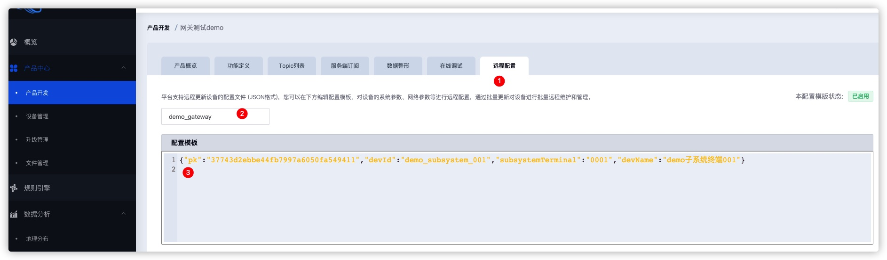

添加成功后刷新 IoTOS 平台设备列表，可以看到添加了2个新的子设备；但是子设备没有在线，这个需要配合自己的业务进行处理，会在下面进行说明。

可以尝试修改远程配置的内容，删除第一条记录，保存并启用后，查看网关设备的子设备列表，会发现设备列表中只存在一个子设备了。
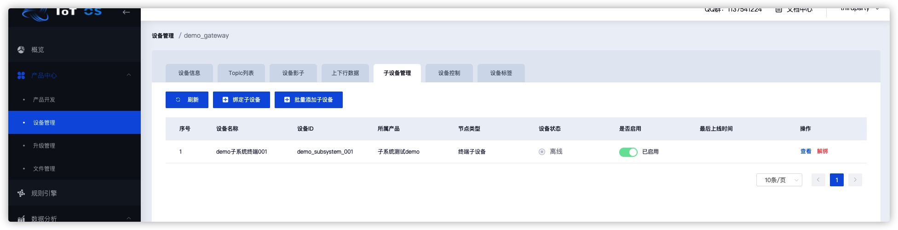

## 业务开发

上面演示中之所以子设备能够自动生成，是因为网关的远程配置功能。配置内容**每行**是一个 `json 对象`。其中 `pk` 、 `devId` 和 `devName` 分别是 IoTOS
平台上的子设备的 pk，devId 和设备名称，动态注册的时候会根据这3个属性进行注册。 其他的属性根据子系统进行配置，比如子系统中唯一标识设备的属性叫做 `terminalId`
，则可以使用  `terminalId` 做映射；如果有其他也需要的属性可以一并添加。

### 子设备登录、登出

调用 `KlinkService#devLogin` 方法可以使子设备在线；`devLogout` 则可以使子设备离线。

### 发送业务数据

发送的业务数据的字段需要在产品的[物模型](http://hy.hekr.me/iot-docs-test/web/content/%E8%AE%BE%E5%A4%87%E6%8E%A5%E5%85%A5/%E7%89%A9%E6%A8%A1%E5%9E%8B.html)中定义，并且定义相应的命令。

发送数据使用方法： `KlinkService#devSend`。该方法重载了2个方法：

- `public void devSend(String pk, String devId, String cmd)` 可以只发送命令
- `public void devSend(String pk, String devId, String cmd, Map<String, Object> params)` 发送命令和参数

#### 设备映射

DeviceMapper 类做了设备映射关系；该关系是通过服务启动的时候自动获取远程配置或者主动更新远程配置来做映射的。

主要方法有：

- `public static Set<DeviceMapper> getAll()` 获取所有设备信息
- `public static Optional<DeviceMapper> getByPkAndDevId(String pk, String devId)` 根据 pk 和 devId
  获取设备信息
- `public static Optional<DeviceMapper> getBySubSystemProperties(Props p)` 根据子系统的设备属性获取设备信息
- `public static String getStatus()` 获取状态信息
- `public String getPk()` 获取设备的 pk
- `public String getDevId()` 获取设备的 devId
- `public String getDevName()` 获取设备的名字
- `public <T> T getProp(String prop)` 根据属性名字获取设备属性值，注意远程配置中数据类型

### 下发命令处理

框架封装了下发命令处理过程，只需要实现 `SubsystemCommandService` 接口并根据要求定义成 Spring 的 bean 即可，Bean要求：

实现类要加 `@Service("{CMD}SubsystemCommandService")`，其中 `{CMD}` 为 IoTOS 物模型命令。

实现方法 `void handle(DeviceMapper deviceMapper, ModelData data)`；参数 `deviceMapper` 是控制的设备， `data`
是物模型信息，实际需要参考子产品定义的物模型。

### 其他开发接口

- `MqttDisConnectListener` mqtt 连接监听，可以参考 `CoreMqttConnectedListenerImpl`
  实现；如果需要在软网关连接建立或者重连的时候进行业务处理，可以实现这个接口
- `MqttDisConnectListener` mqtt 断开连接监听，可以参考 `CoreMqttDisConnectListenerImpl`
  实现；如果需要在软网关连接断开的时候进行业务处理，可以实现这个接口
- `TcpMessageListener` tcp server 消息处理监听器
- `CommonMessageListener` tcp client, udp client, udp server 消息处理监听器
- `EventListener` 事件监听器

### 发布

修改对应的 模块版本号，然后 执行

`mvn deploy -DaltDeploymentRepository=hekr-maven::default::file:maven/repository/`

执行完成后，提交到 gitee 上。
